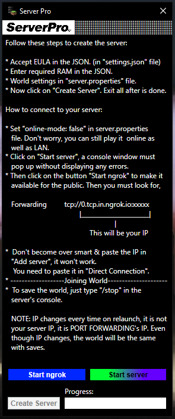

# Server Pro 
 

Create **Minecraft servers** effortlessly with just a few clicks using this intuitive server creation tool. Whether you're a seasoned server administrator or a newcomer to the Minecraft community, our tool simplifies the process of setting up a server, allowing you to focus more on building and playing with friends. 
 
Get started with your Minecraft adventure today! [Download Server Pro](https://drive.google.com/file/d/1lXEuaVvQSNWbK0g6cAQ10l53FF5gprXM/view?usp=drivesdk).

## Screenshots: 
 
 
When u click on <u>Download</u> button, you may probably see google drive saying it is suspicious. It says cuz the .exe & .bat files in the zip are not internally signed. If you don't trust me, you can try running them in virtual machines or reverse engineer them. 
